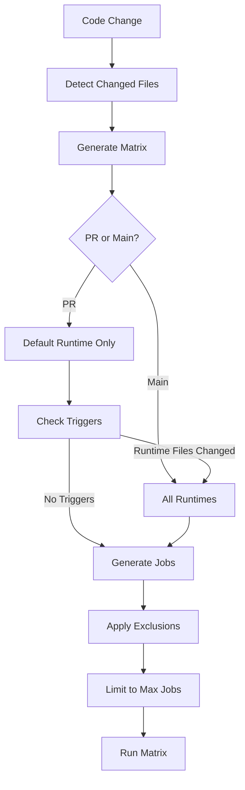

# CI/CD Documentation

This directory contains configuration and documentation for the comprehensive nested CI matrix system used to test web frameworks.

## Overview

The CI matrix system tests frameworks across three levels:
1. **Languages** (Python, JavaScript, Java, Go, Ruby, PHP, etc.)
2. **Frameworks** (Django, Express, Spring Boot, Gin, etc.)
3. **Runtime Versions** (Python 3.9-3.13, Node 18-22, Java 11-21, etc.)

## Documentation Files

### 📘 [MATRIX_SYSTEM.md](MATRIX_SYSTEM.md)
**Complete system documentation**
- Architecture overview
- How the three-level matrix works
- Optimization features (selective testing, caching, etc.)
- Adding new languages, frameworks, and runtime versions
- Configuration reference
- Best practices and troubleshooting
- FAQ

**Read this first** if you want to understand how the system works.

### 🚀 [MATRIX_QUICKREF.md](MATRIX_QUICKREF.md)
**Quick reference guide**
- Common operations and commands
- Quick lookup for configuration locations
- Useful command snippets
- Environment variables reference
- Debugging tips

**Use this** for day-to-day operations and quick lookups.

### 📝 [MATRIX_EXAMPLES.md](MATRIX_EXAMPLES.md)
**Practical examples**
- Testing specific combinations
- Adding runtime overrides
- Excluding incompatible combinations
- Advanced scenarios and patterns
- Performance optimization
- Real-world use cases

**Refer to this** when implementing specific features or solving common problems.

### 🔄 [MIGRATION_GUIDE.md](MIGRATION_GUIDE.md)
**Migration guide**
- What changed from the old system
- Step-by-step migration instructions
- Backward compatibility information
- Testing the migration
- Rollback procedures
- Common issues and solutions

**Follow this** if you're updating from the previous CI system.

## Configuration Files

### ⚙️ [matrix-config.yaml](matrix-config.yaml)
**Matrix configuration**

The central configuration file that defines:
- Available runtime versions for each language
- Default runtime versions
- Optimization settings
- Cache paths
- Framework runtime overrides
- Exclusions for incompatible combinations

### 🔧 [workflows/ci.yml](workflows/ci.yml)
**GitHub Actions workflow**

The CI workflow that:
- Generates the dynamic matrix
- Sets up language-specific runtimes
- Runs build and test jobs
- Implements caching strategies

## Quick Start

### View Matrix Locally

```bash
# Install dependencies
bundle config set --local path 'vendor/bundle'
bundle install

# Test matrix generation
export PATH="$HOME/.local/share/gem/ruby/3.2.0/bin:$PATH"
export FILES='["python/fastapi/config.yaml"]'
export GITHUB_EVENT_NAME=pull_request
bundle exec rake ci:matrix | jq
```

### Common Tasks

| Task | Documentation |
|------|---------------|
| Add a new language | [MATRIX_SYSTEM.md](MATRIX_SYSTEM.md#adding-new-languages) |
| Add a new framework | [MATRIX_SYSTEM.md](MATRIX_SYSTEM.md#adding-new-frameworks) |
| Add runtime versions | [MATRIX_SYSTEM.md](MATRIX_SYSTEM.md#adding-runtime-versions) |
| Exclude combinations | [MATRIX_EXAMPLES.md](MATRIX_EXAMPLES.md#excluding-incompatible-combinations) |
| Override framework runtimes | [MATRIX_EXAMPLES.md](MATRIX_EXAMPLES.md#adding-framework-runtime-overrides) |
| Debug matrix issues | [MATRIX_QUICKREF.md](MATRIX_QUICKREF.md#debugging) |

## Key Features

### 🎯 Selective Testing
- **Pull Requests**: Test only default runtime versions by default
- **Main/Master**: Test all runtime versions
- **Smart Triggers**: Full testing when runtime-related files change

### ⚡ Caching
- Language-specific dependency caching
- Automatic cache key generation
- Faster build times

### 🔧 Flexible Configuration
- Easy to add new languages and frameworks
- Framework-specific runtime overrides
- Exclude incompatible combinations
- Centralized configuration management

### 📊 Optimization
- Parallel job limits (default: 256)
- Selective testing reduces unnecessary runs
- Efficient matrix generation

## How It Works



## Configuration Hierarchy

The system merges configuration from three levels:

1. **Repository Level**: `.github/matrix-config.yaml`
   - Runtime versions
   - Defaults
   - Optimization settings

2. **Language Level**: `<language>/config.yaml`
   - Language version
   - Available engines
   - Build dependencies

3. **Framework Level**: `<language>/<framework>/config.yaml`
   - Framework version
   - Selected engines
   - Framework-specific settings

## Support and Contributing

### Getting Help

1. Check the documentation files in this directory
2. Review [matrix-config.yaml](matrix-config.yaml) for current settings
3. Test locally using the commands in [MATRIX_QUICKREF.md](MATRIX_QUICKREF.md)
4. Open an issue with:
   - What you're trying to achieve
   - Current behavior vs expected behavior
   - Relevant configuration snippets

### Contributing Improvements

When contributing to the matrix system:

1. **Test locally first**
   ```bash
   bundle exec rake ci:matrix | jq
   ```

2. **Document changes**
   - Update relevant documentation files
   - Add examples if introducing new features
   - Update [matrix-config.yaml](matrix-config.yaml) with clear comments

3. **Consider backward compatibility**
   - Existing frameworks should continue working
   - Migration path for breaking changes

4. **Monitor impact**
   - Check matrix size doesn't exceed limits
   - Verify build times remain reasonable
   - Review success/failure rates

## Architecture Decision Records

### Why Three Levels?

- **Languages**: Natural organizational unit in the repository
- **Frameworks**: Each has unique characteristics and engines
- **Runtimes**: Test compatibility across language versions

### Why Selective Testing?

- **Resource Efficiency**: PRs don't need full matrix by default
- **Faster Feedback**: Test default runtime quickly
- **Comprehensive Coverage**: Main branch tests everything

### Why Centralized Configuration?

- **Maintainability**: Single source of truth for runtime versions
- **Consistency**: Same versions across all frameworks
- **Easy Updates**: Update versions in one place

## Troubleshooting

| Problem | Solution |
|---------|----------|
| Matrix too large | Adjust `max_parallel_jobs` in matrix-config.yaml |
| Wrong runtime tested | Check `default_runtimes` and triggers |
| Build failures | Review exclusions and framework compatibility |
| Cache not working | Verify cache paths in matrix-config.yaml |

See [MATRIX_SYSTEM.md](MATRIX_SYSTEM.md#troubleshooting) for detailed troubleshooting.

## Related Files

- `/.tasks/ci.rake` - Matrix generation logic
- `/Rakefile` - Framework configuration helpers
- `/<language>/config.yaml` - Language configurations
- `/<language>/<framework>/config.yaml` - Framework configurations

## Version History

- **v1.0** - Initial nested matrix system with runtime versioning
  - Three-level matrix (language/framework/runtime)
  - Selective testing for PRs
  - Centralized configuration
  - Dependency caching
  - Dynamic matrix generation

## License

Same as the main repository.
